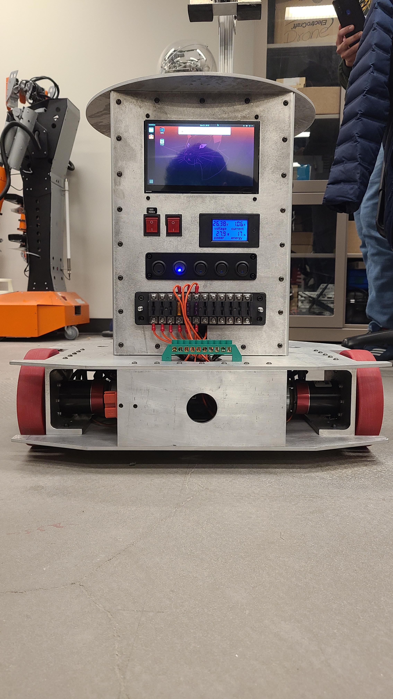
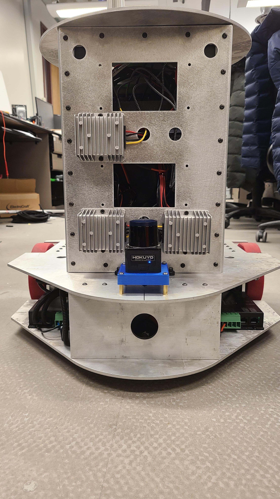
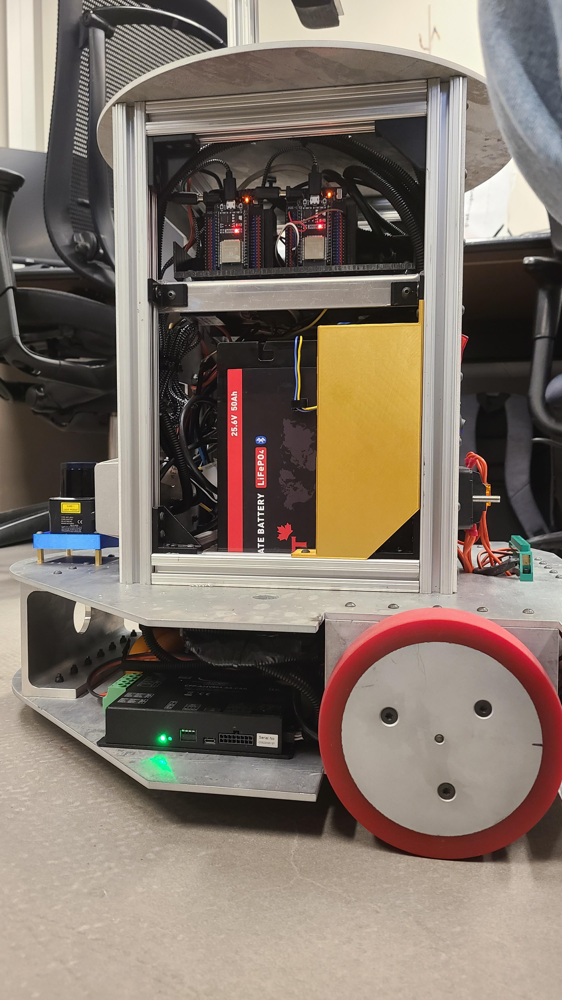

# kella-v1.0
 Humonoid Robot Development Project

 ### Base Design and Development
 

 
 
 
 

 
 ### YouTube Video-Base Manual Mode Testing

[Watch on YouTube](https://www.youtube.com/watch?v=laG0K3bYE8s)

# Design Power Point 

[View Design PPT](photos/pdf.pdf)

